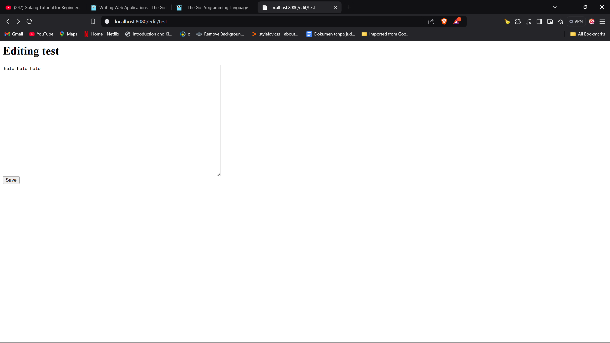

# Web-app-Go

Berikut beberapa tampilan UI dari tutorial web application menggunakan golang:

*   Disini kita menambahkan fungsi untuk menangkap URL.path yang diberikan oleh user. Kemudian kita akan print hasil tersebut dengan format **fmt.Fprintf(w, "Hi there, I love %s!", r.URL.Path[1:])**

    Tampilan UI ketika menjalankan **http://localhost:8080/monkeys**

    

    Tampilan UI ketika menjalankan **http://localhost:8080/golanng**

    

*   Kemudian kita memodifikasi kode menjadi dan menambahkan fungsi untuk menangkap sebuah file .txt. Berikut adalah fungsi nya:

    ```go

    func viewHandler(w http.ResponseWriter, r *http.Request) {
        title := r.URL.Path[len("/view/"):]
        p, _ := loadPage(title)
        fmt.Fprintf(w, "<h1>%s</h1><div>%s</div>", p.Title, p.Body)
    }

    ```
    Jika kita membuat sebuah file bernama test.txt dan kita isi dengan tulisan **Hello World** maka tampilan UI nya akan seperti berikut:

    

*   Setalah itu kita menambahkan form untuk mengedit hasil dari file txt yang kita miliki sebelumnya. Kita perlu menambahkan html dan beberapa fungsi yang diperlukan untuk melakukan hal tersebut. Berikut adalah tampilan UI nya:

    

    Lalu ketika kita menekan edit, maka kita akan diarahkan ke sebuah form untuk mengedit file txt yang kita miliki.

    

*   Pada langkah terakhir, kita dapat membuat sebuah file txt yang baru melalui link dari user. Sebagai contoh jika kita mengakses link **localhost:8080/view/formPage** maka kita akan diarahkan ke halaman **localhost:8080/edit/formPage** seperti berikut:

    

    Lalu jika kita melakukan input **Belajar Web Application menggunakan golang** maka kita akan diarahkan ke halaman **localhost:8080/view/formPage** sesuai dengan input yang kita berikan sebelumnya.

    